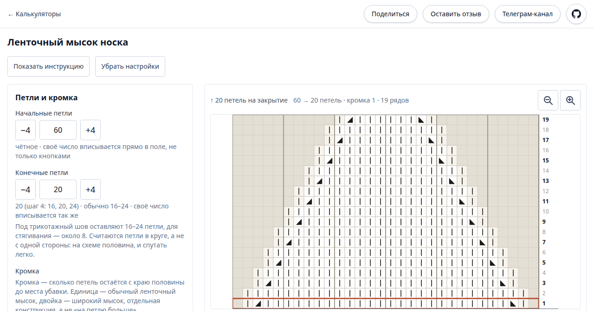

# Калькуляторы для вязания

Статический сайт с калькуляторами для вязания. Первый и пока единственный — **ленточный мысок
носка cuff-down**: по числу петель и ритму убавок он рисует схему, говорит, сколько выйдет рядов,
и считает связанные ряды.

Главный сценарий — телефон, лежащий рядом с вязанием; с компьютера страница тоже открывается
и от 1240 px раскладывается в две колонки.

**Конструкция зафиксирована и не настраивается:** мысок **cuff-down** (от манжеты к пальцам),
**ленточный** (круг делится ровно пополам, убавки по краям каждой половины). Закрытие выбирает
мастер — калькулятор считает петли **до** него и самого закрытия не касается.

**Вне области первой версии:** расчёт по плотности вязания и ответ «когда начинать мысок» (считаем
в петлях, сантиметров нет), мысок toe-up, круглый мысок и звёздочка, обратный режим «хочу мысок
в N рядов — подбери ритм».

## Демо



Кликабельно: <https://fey.github.io/knitting-tools/toe-band/>

Эта же картинка — карточка для соцсетей: она объявлена в `og:image` обеих страниц, и ссылка
разворачивается ей в Telegram, VK и прочих. Две вещи, которые иначе примут за поломку:

- **Превью появится только после деплоя.** Сборщик превью читает живую страницу, на ветке
  читать нечего — проверять до мержа в `main` бессмысленно.
- **Карточка одна на любой расчёт.** Hash до сервера не доходит, поэтому ссылка
  с `#s=60&e=20&k=1&r=even` развернётся тем же кадром, что и голая.

**Правил экран — пересними карточку:** `make og`, картинка едет в коммит вместе с правкой.
Кадр снимается с живой страницы, поэтому оставленный на 4173 preview надо погасить: иначе
его подхватит `reuseExistingServer`, и карточка снимется со вчерашнего `dist`.

## Адреса

| Адрес | Что там |
|---|---|
| <https://fey.github.io/knitting-tools/> | витрина разделов |
| <https://fey.github.io/knitting-tools/toe-band/> | калькулятор ленточного мыска |

Параметры расчёта живут в hash адреса, поэтому ссылкой воспроизводится ровно тот расчёт, который
видели: `…/toe-band/#s=60&e=20&k=1&r=even`. Прогресс ряда в ссылку не попадает — он в `localStorage`.

## Стек

- **Vite 8** — многостраничная сборка: два входа, два настоящих `index.html`.
- **Vue 3.5**, Composition API, SFC.
- **TypeScript**, **Tailwind 4** через плагин `@tailwindcss/vite`.
- **Vitest** — ядро, **Playwright** — страница.
- **GitHub Pages** + Actions, `base: '/knitting-tools/'`.

**Роутера нет и не нужен**: в hash-режиме он занял бы тот же hash, где лежат параметры расчёта,
а в history-режиме потребовал бы копию `index.html` в `404.html`. Две страницы — два входа сборки,
между ними обычные относительные ссылки. **Pinia нет**: состояние калькулятора — одно composable.

**Бэкенда нет вовсе.** Обратная связь уходит прямо из браузера в Google Forms.

## Быстрый старт

Нода — **26**, версия прибита в `mise.toml` (`mise install` поднимет её); тот же мажор стоит в CI.

```
make install    # зависимости из lock-файла и git-хуки
make browsers   # Chromium под прогон страницы
make dev        # стенд на 5173
```

Открывать по адресу **с путём** — `http://localhost:5173/knitting-tools/`. Голый
`http://localhost:5173/` отдаст 404: `base` в `vite.config.ts` равен `/knitting-tools/`.
Калькулятор — на подстранице `http://localhost:5173/knitting-tools/toe-band/`.

Кнопка «Оставить отзыв» появляется, только если подставлена ссылка на форму. Локально это
`.env.local` (в репозиторий не едет), в Actions — секрет:

```
VITE_FEEDBACK_PREFILL_URL=https://docs.google.com/forms/d/e/<ID>/viewform?entry.1=…&entry.2=…&entry.3=…
```

**Без неё сборка не падает** — страница просто уезжает без кнопки, молча. Это самый тихий способ
получить «всё собралось, а функции нет».

## Команды

Всё гоняется через `make`. `make` без цели печатает этот же список:

| Цель | Что делает |
|---|---|
| `make install` | Зависимости из lock-файла |
| `make browsers` | Chromium под прогон страницы |
| `make dev` | Локальный стенд на 5173 |
| `make build` | Проверка типов и сборка в `dist` |
| `make preview` | Собранная страница на 4173. Под прогон e2e, стенд поднимают через `dev` |
| `make test` | Оба шва разом — то же, что гоняет CI |
| `make test-unit` | Ядро под Vitest |
| `make test-e2e` | Страница под Playwright: `functional` и `desktop` |
| `make test-screens` | Скриншоты схемы. В CI не гоняются намеренно |
| `make test-screens-update` | Пересъёмка базлайнов после правки экрана |
| `make og` | Пересъёмка карточки для соцсетей в `public/og.png` |

Слоя два, и граница жёсткая: **сама команда со всеми флагами — скриптом в `package.json`**,
а **`Makefile` её только зовёт**. Флаги правятся в одном месте, поэтому CI и локаль не начинают
проверять разное. Новая команда заводится **парой**: скрипт в `package.json` и цель в `Makefile`;
шаг CI зовёт цель, а не пишет команду строкой.

## Тесты

Швов два — по тому, что шов способен увидеть.

**Ядро под Vitest** (`make test-unit`): арифметика, разбор hash, тексты сообщений. Тесты лежат
рядом с кодом, `src/**/*.test.ts`.

**Страница под Playwright** (`make test-e2e`), три проекта:

| Проект | Вьюпорт | Что проверяет |
|---|---|---|
| `functional` | 390×844 | всё, что живёт только в DOM. Вьюпорт телефонный намеренно: почти все требования — телефонные |
| `desktop` | 1280×900 | раскладку: две колонки, вводка над ними, схема без горизонтальной прокрутки. Замерами блоков, а не скриншотами |
| `screens` | 390×844 | скриншоты схемы. В CI **не** гоняется |

Скриншотный проект в CI не запускается намеренно: базлайны сняты на машине мастера, на раннере
рендер другой, и первый же push положил бы прогон вместе с деплоем. **Правил экран — пересними
базлайны** (`make test-screens-update`), картинки едут в коммит вместе с правкой.

## Деплой

`.github/workflows/deploy.yml`: на каждый PR — тесты и сборка, на push в `main` — они же и деплой
на GitHub Pages (официальный Pages-workflow, ветки `gh-pages` нет).

## Как устроен код

| Где | Что там |
|---|---|
| `src/calculators/toe/core/` | Арифметика, разбор hash, тексты. **Чистый TypeScript без единого импорта из Vue** |
| `src/calculators/toe/useToeCalculator.ts` | Состояние калькулятора. Здесь и только здесь — Vue и браузер (`location`, `history`, `localStorage`) |
| `src/calculators/toe/components/` | Экран калькулятора, включая оболочку его страницы |
| `src/pages/` | Входы страниц (`home.ts`, `toe-band.ts`) и витрина разделов. Каждому входу отвечает свой файл сборки: `index.html` и `toe-band/index.html` |
| `src/shared/` | Общее на весь проект: шапка, доступ к `localStorage`, обратная связь |
| `e2e/` | Спеки Playwright, по каталогу на проект |

## Документы

- **`CLAUDE.md`** (он же `AGENTS.md`) — рабочие инструкции, с них начинают и человек, и агент.
- **`.scratch/toe-calculator/spec.md`** — **нормативная спека калькулятора**: не архив, а действующий
  контракт поведения. Разошёлся код со спекой — это баг кода; меняешь поведение осознанно — правь
  спеку тем же коммитом и неси номер раздела в сообщении.
- **`.scratch/toe-calculator/`** — карта решений, восемь закрытых тикетов, research и прототипы.
  Законченный markdown-архив: новая работа заводится в GitHub Issues, а не дописывается туда.
- **Коммиты** — Conventional Commits с описанием по-русски, хук `commit-msg` проверяет заголовок.
  Правило и таблица типов — в `CLAUDE.md`, раздел «Коммиты».
- **`docs/agents/`** — локальный стенд, работа с issues через `gh`, канонические метки триажа.

## Язык

Спека, тикеты, интерфейс, комментарии и коммиты — по-русски; технические термины
и идентификаторы остаются как есть. Словарь домена закреплён в §2 спеки: **начальные**
и **конечные петли**, **убавочный** и **промежуточный ряд**, **интервал**, **ритм**, **кромка**,
**закрытие**, **ленточный мысок**. Синоним значит разойтись со спекой.

**Текст не привязывается к полу того, кто вяжет** — кнопки, подписи, пояснения, тикеты.
Нейтральное существительное для пользователя — «мастер».
